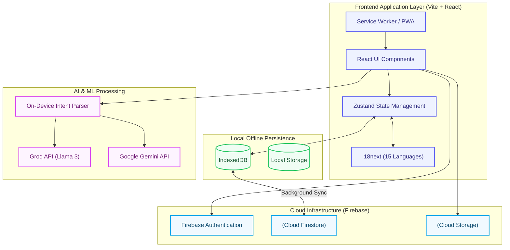
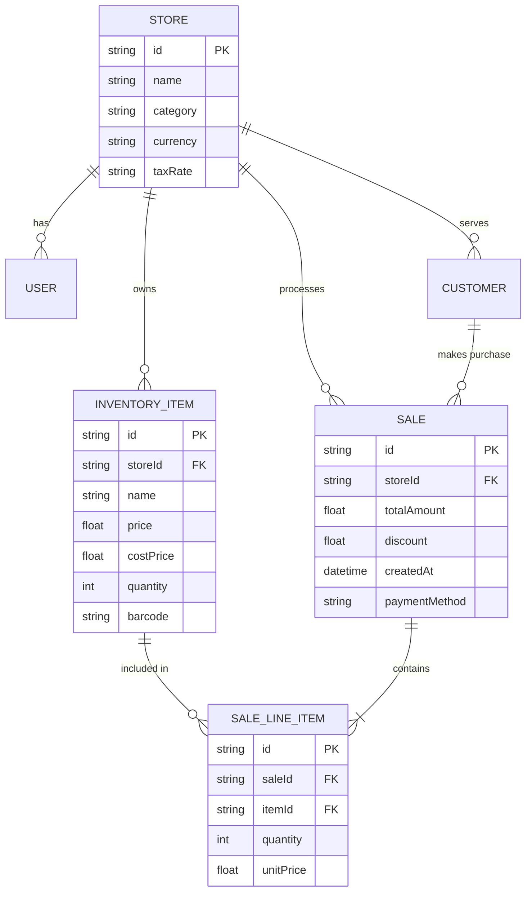
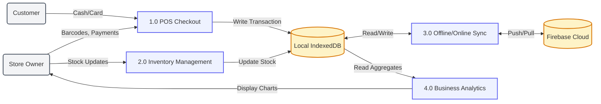
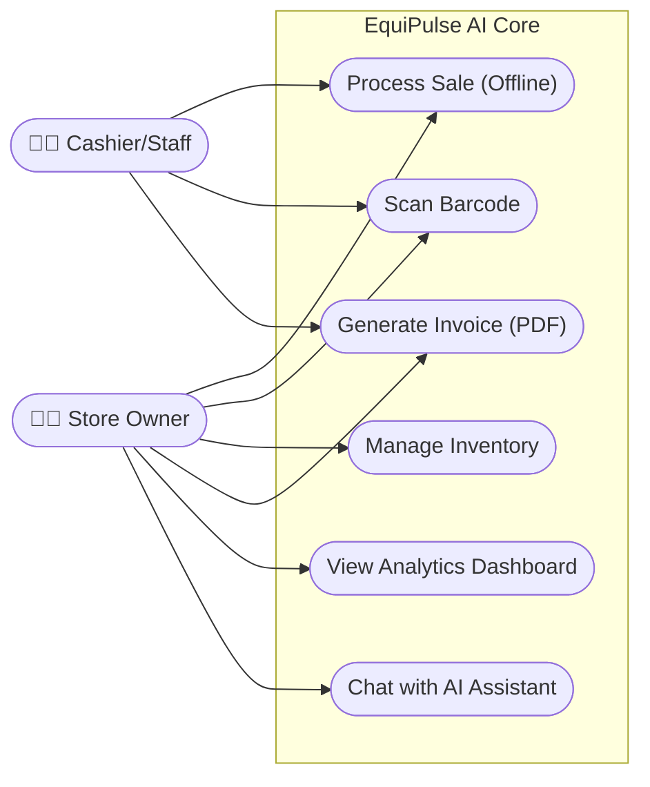
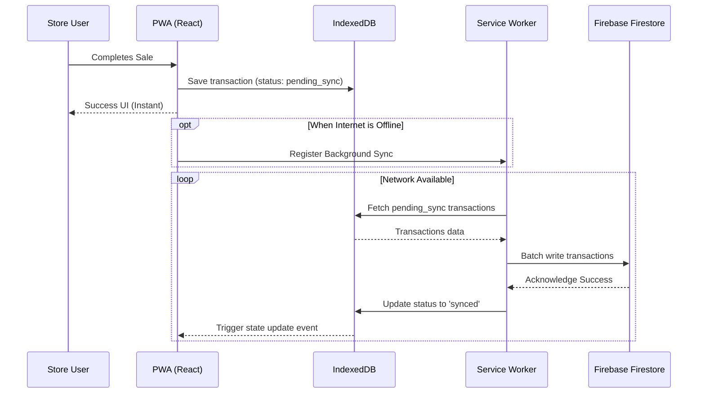

# EquiPulse AI 🚀
**The Intelligent POS & Supply Chain Ecosystem for the Global South**

[](https://equipulse-ai.equisaas-bd.com/)
[](https://opensource.org/licenses/MIT)
[](https://equipulse-ai.equisaas-bd.com/)

> **Live Demo:** [https://equipulse-ai.equisaas-bd.com/](https://equipulse-ai.equisaas-bd.com/)

## 📖 Problem & Solution Statement
In the Global South, millions of micro-entrepreneurs and SMEs run their daily operations on paper due to unreliable internet, complex software, and high costs. **EquiPulse AI** bridges this gap. It is an **offline-first, AI-driven Point of Sale (POS) and Inventory Management ecosystem**. Built with Vite, React, and Firebase, it features real-time sync, local-first architectures (IndexedDB), and on-device NLP search capabilities—ensuring businesses never stop, even when the internet does.

---

## 🏗 System Architecture Diagram



---

## 📊 Entity-Relationship Diagram



---

## 🔄 Data Flow Diagram Level 1



---

## 👥 Use Case Diagram



---

## ⏱ Sequence Diagram



---

## 💻 Tech Stack
* **Framework:** React 18 with Vite
* **Language:** TypeScript
* **State Management:** Zustand (with local storage persistence)
* **Styling:** Tailwind CSS + Framer Motion
* **Database & Auth:** Firebase (Firestore, Auth, Storage)
* **Offline Storage:** IndexedDB (via `idb`)
* **AI Integration:** Groq (Llama 3), Google Gemini, Heuristic Regex Parsing

---

## 🚀 Run & Execution
1. **Clone the repository:**
   ```bash
   git clone https://github.com/kholipha-ahmmad-al-amin/EquiPulse-Ai.git
   cd EquiPulse-Ai
   ```
2. **Install Dependencies:**
   ```bash
   npm install
   ```
3. **Run Development Server:**
   ```bash
   npm run dev
   ```

---

## Team : EquiSaaS BD :
**Bangladesh's First Open Tech Cooperative**

### Members:

🇧🇩<br/>
**Sandipta Karmakar**<br/>
Project Coordinator<br/><br/>
🇧🇩<br/>
**Kholipha Ahmmad Al-Amin**<br/>
Backend / Database / Scraper Engineer<br/>
Team Leader / Project Coordinator<br/><br/>
🇧🇩<br/>
**Abu Hurayra**<br/>
UI/UX / Frontend Developer<br/>
Presentation / Communication Lead<br/><br/>
🇧🇩<br/>
**Jannatul Nayeem**<br/>
Presentation / Communication Lead<br/><br/>
🇧🇩<br/>
**Sanzida Rahman**<br/>
Member<br/>
UI/UX / Frontend Developer<br/>

---

<div align="center">
  <p>Built with ❤️ by EquiSaaS BD</p>
</div>
