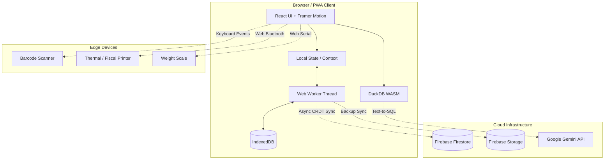
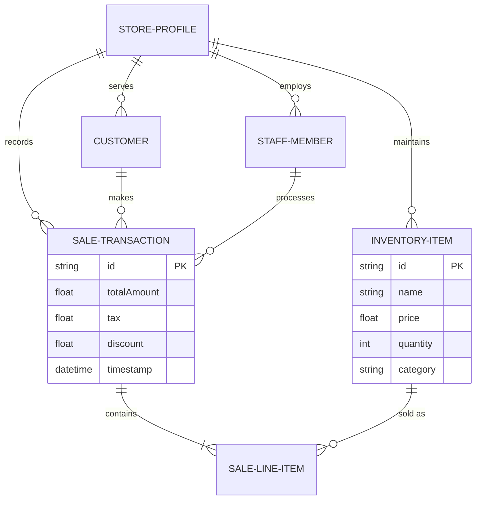
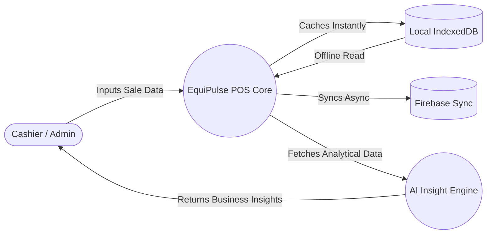
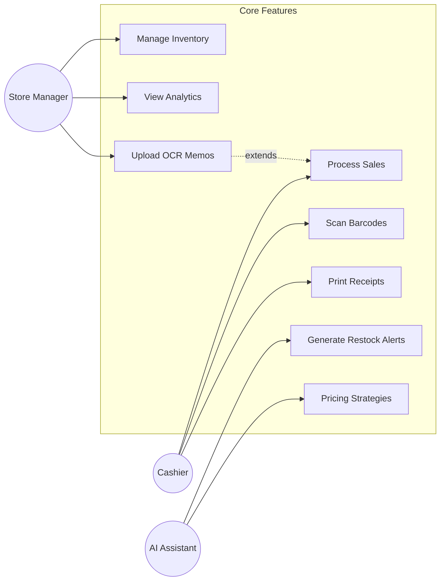
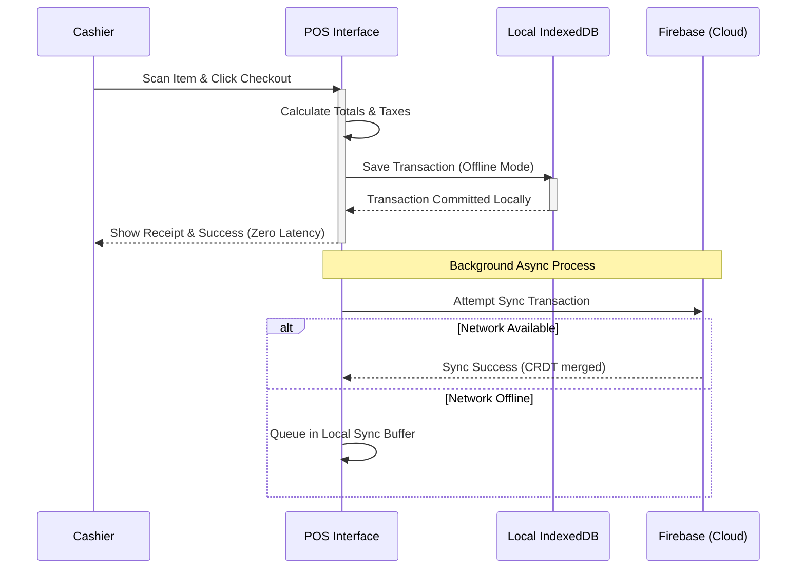

<div align="center">
  

  # EquiPulse AI
  **The Intelligent Operating System for Global Micro-SMEs**

  [](https://equipulse-ai.equisaas-bd.com/)
  [](https://equipulse-ai.equisaas-bd.com/)
  [](https://www.gnu.org/licenses/agpl-3.0)

  *Engineered by Team EquiSaaS BD – Bangladesh's First Open Tech Cooperative.*
</div>

---

## 🏛️ Engineering Manifesto: The Problem & The Vision

### The Problem
Traditional POS and ERP software is built for the top 1% of businesses—enterprises with continuous power, gigabit internet, and dedicated IT teams. But what about the 99%? 
The micro-SMEs, corner stores, and emerging markets operate in environments where internet connectivity is brittle, hardware is constrained, and cloud latency is unacceptable. Existing solutions fail them by enforcing "cloud-only" paradigms, resulting in lost sales when the network drops.

### The Solution: EquiPulse AI
EquiPulse AI is a Silicon Valley-grade, **Local-First AI Data Operating System**. We engineered it from the ground up to operate completely independent of the internet while leveraging decentralized Peer-to-Peer (P2P) synchronization and intelligent browser-native capabilities (IndexedDB + Web Workers + Wasm).

**Core Philosophies:**
1. **Local-First Autonomy:** The app loads instantly and works 100% offline. Data lives locally first and syncs to the cloud asynchronously using CRDTs (Conflict-free Replicated Data Types).
2. **Zero-Latency AI:** Intelligence should not require an API call. We embedded DuckDB WASM and local AI routing directly into the client.
3. **Hardware Agnostic:** Whether scanning barcodes, printing receipts (Bluetooth Thermal & Fiscal), or syncing data, the system communicates directly with hardware via modern Web APIs.

---

## 🚀 Live Demo
Experience the raw speed of a true local-first architecture. 

👉 **[Access the Production Environment: https://equipulse-ai.equisaas-bd.com/](https://equipulse-ai.equisaas-bd.com/)**

> *Note: For the best offline-first experience, install the app directly via your browser as a Progressive Web App (PWA).*

---

## 💻 Elite Technology Stack

- **Framework:** React 19 + Vite (Highly optimized module bundling)
- **Styling:** Vanilla CSS + Tailwind CSS + Framer Motion (Hardware-accelerated animations)
- **Data Persistence:** IndexedDB (via localForage) + Firebase (Cloud Sync) + DuckDB-Wasm
- **State Management:** Zustand with CRDT sync logic
- **AI & Analytics:** DuckDB WASM (Browser-native OLAP engine) + Gemini Pro integration + Local Model Fallbacks
- **Hardware Integration:** Web Bluetooth API (Thermal Printing), Web Serial API (Weight Scales)

---

## ⚙️ How to Run Locally

```bash
# 1. Clone the repository
git clone https://github.com/kholipha-ahmmad-al-amin/EquiPulse-Ai.git
cd EquiPulse-Ai

# 2. Install dependencies (Node.js 18+ required)
npm install

# 3. Start the Vite Dev Server
npm run dev
```

---

## 📐 System Architecture Diagram



---

## 🗄️ Entity-Relationship Diagram (ERD)



---

## 🔄 Data Flow Diagram (DFD Level 1)



---

## 🎯 Use Case Diagram



---

## ⏱️ Sequence Diagram (Offline-First Checkout Flow)



---

## 👥 Meet Team EquiSaaS BD
**Bangladesh's First Open Tech Cooperative**

We are a syndicate of passionate engineers and designers united by a single goal: democratizing enterprise technology for the masses.

### Members:
* **🇧🇩 Sandipta Karmakar** (Project Coordinator) — Strategic Planning & Execution
* **🇧🇩 Kholipha Ahmmad Al-Amin** (Team Leader / Project Coordinator / Backend / Database / Scraper Engineer) — System Arch, DB, Scrapers & Sync Engines
* **🇧🇩 Abu Hurayra** (UI/UX / Frontend Developer / Presentation / Communication Lead) — UI/UX Designs, Components & Demos
* **🇧🇩 Jannatul Nayeem** (Presentation / Communication Lead) — Pitch Deck & Communications
* **🇧🇩 Sanzida Rahman** (Member / UI/UX / Frontend Developer) — Design System & Component Arch

---
<div align="center">
  <p><i>"Software should work for the user, not the network."</i></p>
  <b>© 2026 EquiPulse AI by EquiSaaS BD</b>
</div>
