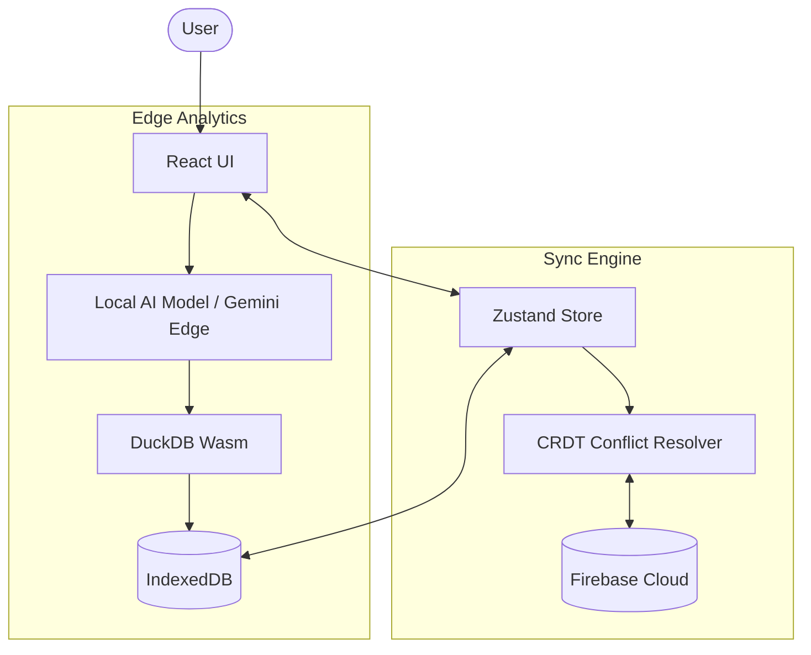

# Software Design Document (SDD)

## 1. System Architecture
EquiPulse AI utilizes an **Offline-First, Browser-Native Architecture**. It pushes complex processing to the edge (the user's device) rather than relying on a centralized cloud server for core operations.

* **Frontend Framework:** React 19 + TypeScript + Vite.
* **Styling & Animation:** Vanilla CSS, Tailwind CSS, and Framer Motion for hardware-accelerated fluid transitions.
* **Local Persistence Layer:** IndexedDB managed via localForage (with Dexie/Zustand bindings).
* **Analytics Engine:** DuckDB-Wasm (Browser-native OLAP engine).
* **Cloud Synchronization Layer:** Firebase Firestore (via custom CRDT and Background Workers).

## 2. Components Design

### 2.1 State Management (Zustand & CRDT)
All active state lives in memory (Zustand) and is immediately flushed to IndexedDB.
* **CRDT (Conflict-Free Replicated Data Types):** Every record contains a globally unique ID, a `timestamp`, and a `logicalClock`.
* During a network reconnection, the Background Sync Worker merges local changes with Firebase. The state with the highest `logicalClock` resolves conflicts.

### 2.2 Artificial Intelligence Subsystem
* **Semantic Search:** Uses a local vector embedding approach via lightweight models inside a Web Worker.
* **In-Browser SQL Analytics:** User inquiries (e.g., "What are my top 5 selling items?") are processed using an LLM (Gemini) that converts Text-to-SQL. This SQL runs entirely locally on DuckDB-Wasm, guaranteeing data privacy and 0ms latency after prompt generation.

### 2.3 UX Psychology Implementations
* **Labor Illusion (`LaborIllusionLoader.tsx`):** Strategically placed during fast automated processes to artificially delay the UI slightly. Studies show users trust AI outputs more if the system visibly "thinks" (particle nodes, simulated processing steps).
* **Goal Gradient (`OnboardingGuide.tsx`):** A stepped onboarding UI that utilizes spotlight CSS cutouts and animated "Action Needed" tooltips. By showing progress bars heavily biased towards completion, users are psychologically compelled to finish setup.
* **Urgency & Scarcity (`PosView.tsx`):** Inventory items dipping below the calculated `minThreshold` trigger a visual red pulse and CRITICAL status tag.

## 3. Data Flow Diagram

## 4. Hardware APIs
* **Web Bluetooth API:** Connects directly to thermal receipt printers.
* **Web Serial API:** Interacts with connected digital scales for grocery/hardware applications.
* **MediaDevices API:** Utilizes the device camera for OCR (Optical Character Recognition) memo scanning.
